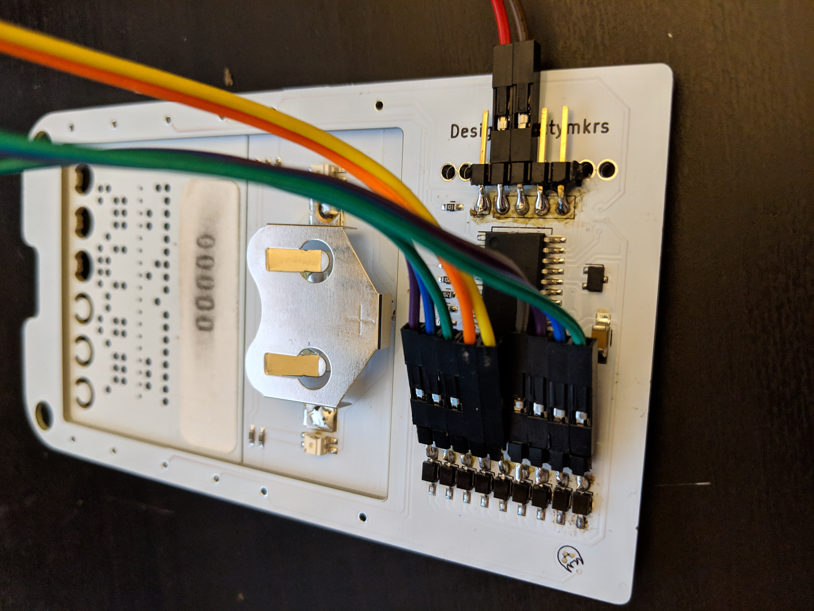

# cyphercon4
Badge hacks from Cyphercon 4 (2019)

## Instructions
Use __punch-tape-decoder.html__ to decode a punch tape into hex codes representing each row of the binary ASCII tape format

Flash __sendHex2Badge.ino__ to a 3 volt logic level arduino compatible microcontroller. I used a TI Stellaris LaunchPad LM4F120 with [Energia](http://energia.nu/), but any 3 volt Arduino Uno should work fine as well. Just change the pin numbers in the sketch.

Solder some jumper wires to your badge's IR sensors. Something like this:



I also soldered some pin headers on to the programming port which I am using to power the badge (3 volts) from the external microcontroller. Brown wire is Ground, Red wire is 3 volts.

Connect all those jumper wires to your external microcontroller. See the arduino sketch comments for details on which pin is which.

Use the included reset.py, party.py, and unlock.py python2 scripts to quickly send known codes to the badge.

Usage can be shown by running, for example, __python unlock.py --help__


## Punch tape data format
7 bit ASCII + even parity bit
<pre>
Row     = Decimal Data (Comment)
--------------------------
01 - 04 = 0102 (static in request form)
05 - 10 = 00 0000  (badge class and number, yes I somehow ended up with badge # 0)
11 - 23 = (User ID)
24 - 41 = (Job Data)
42 - 45 = 0319 (static in request form)
46      = 13 (CR, carriage return)
47      = 10 (LF, line feed)
</pre>


## A few example tapes
These are hex representation of the tape binary/ASCII format that can be pasted directly into my arduino sketch and sent to a badge

0102 000000 GIGAWATTS____ DCFEEDB0B0DEADBEEF 0319 CR LF
<br>```30 b1 30 b2 30 30 30 30 30 30 47 c9 47 41 d7 41 d4 d4 53 a0 a0 a0 a0 44 c3 c6 c5 c5 44 42 30 42 30 44 c5 41 44 42 c5 c5 c6 30 33 b1 39 8d 0a```

Erase stored keys (under chip) ## 01234,5AFE4F1A7F007F0015 -- Fair warning, this performs a full reset of the badge, and is also the only way I know of to disable party mode
<br>```30 b1 30 b2 30 30 30 30 30 30 a0 a0 a0 a0 a0 a0 a0 a0 a0 a0 a0 a0 a0 35 41 c6 c5 b4 c6 b1 41 b7 c6 30 30 b7 c6 30 30 b1 35 30 33 b1 39 8d 0a```

I have to give a shoutout to [EvilMog](https://github.com/evilmog) for duplicating my tape emulator and integrating it with his own work. He is working on scripts to scan and digitize tapes without having to read them hole by hole like I did with my HTML decoder. Very cool, [go check out his repo](https://github.com/evilmog/cyphertapes). He also contributed back some great python scripts to help rapidly send a bunch of tapes to the badge.

### Party mode tapes
Enter in order B --> E --> F

Party Code B ## 0102 030001 WIRE1________ 0123456789ABCDEF01 0319 CR LF
<br>```30 b1 30 b2 30 33 30 30 30 b1 d7 c9 d2 c5 b1 a0 a0 a0 a0 a0 a0 a0 a0 30 b1 b2 33 b4 35 36 b7 b8 39 41 42 c3 44 c5 c6 30 b1 30 33 b1 39 8d 0a```

Party Code E ## 0102 000001 WIRE2________ FEADC0ED5CAFEBEEF5 0319 CR LF
<br>```30 b1 30 b2 30 30 30 30 30 b1 d7 c9 d2 c5 b2 a0 a0 a0 a0 a0 a0 a0 a0 c6 c5 41 44 c3 30 c5 44 35 c3 41 c6 c5 42 c5 c5 c6 35 30 33 b1 39 8d 0a```

Party Code F ## 0102 020001 WIRE2________ B0B05FACE8BADF00D5 0319 CR LF
<br>```30 b1 30 b2 30 b2 30 30 30 b1 d7 c9 d2 c5 b2 a0 a0 a0 a0 a0 a0 a0 a0 42 30 42 30 35 c6 41 c3 c5 b8 42 41 44 c6 30 30 44 35 30 33 b1 39 8d 0a```

You can see the results of sending the last party code to my badge here:


### Mission Accomplished mode
Run the __unlock.py__ script in this repo to rapidly send all 32 codes to the badge, one after another, unlocking a different party mode than the one demonstrated above.